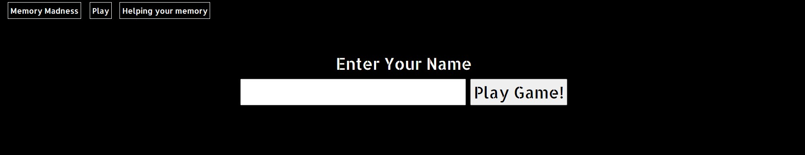

# Memory Match - a game to improve your memory

This project is designed as a memory game to help improve your memory and have some fun while doing so. It includes a click counter so that improvement progress can be tracked.
Information is also available to show the user why playing games like this are good for your memory and the effects it can have.

## UX

This game was designed to help with memory so when designing UX I wanted to keep it as simple as possible so when choosing colours and fonts I went with something with high contrast (black and white) and a font that stands out. There is easy navigation using the navbar which is responsive and collapses when on smaller screens

## Wireframes

The wireframes were done using Miro 

URL - https://miro.com/app/board/o9J_lbijqO4=/ 

## User Stories

1. As a user I want to play a game that is fun and based around improving memory.

2. As a user I want to know what my current skill level is and if I'm improving.

3. As a user I want a game that I can play and learn easily without a steep learning curve.

4. As a user I want to learn how playing memory games can help improve my memory.

5. As a user I want to be able to play on my mobile phone so I can play on the move.

## Existing Features

- Memory game that can be played on any screen size
- Scored generated based on number of clicks to show user how well they did
- Pop up elements to show why playing these games is good for your memory
- Simple UI to not distract from the game and interfere with user playing

## Features to add in future
- Scoreboard to show top scorescreen
- Difficulty levels - make easier and harder versions available to user

## Tech used

- [Bootstrap](https://getbootstrap.com/)
    - The project uses **Bootstrap** to provide the layout of the pages. Components are also used to create the carousel within the gallery, the modal for booking the band and media object used to display the band info on the about us page

- [JQuery](https://jquery.com)
    - The project uses **JQuery** as part of bootstrap components

- [Popper](https://popper.js.org/)
    - The project uses **Popper** as part of the bootstrap/jquery

- [GoogleFonts](https://fonts.google.com/)
    - The project uses **GoogleFonts** to provide the fonts used on the pages

## User story testing

1. As a user I want to play a game that is fun and based around improving memory.
    1. Opening the page the UI is clear, i enter my name and hit play
    
    
    
    2. The game board appears and I am able to play a game

    

2. As a user I want to know what my current skill level is and if I'm improving.
    1. When the game has finished I am able to see my score for my previous game on the new start screen that appears when the game is finished

    

3. As a user I want a game that I can play and learn easily without a steep learning curve.
    1. The game is very easy and based on a well known game of card matching, the controls are as simple as clicking or touching the screen

4. As a user I want to learn how playing memory games can help improve my memory.
    1. From the starting screen there is a button on the nav bar that says "helping your memory"

    

    2. After this button is pressed a new element pops up with info about why this game is good for your memory

    

5. As a user I want to be able to play on my mobile phone so I can play on the move.
    1. When opening the page on my phone it is formatted to fit as needed

    

    2. When starting the game the cards are separated with bigger vertical spacing to make it easier to select the correct card

    

## Feature testing

### Feature testing 
| Feature | Action taken  | Expected result | Pass/Fail |
| :--- | :--- | :--- | :--- |    
| Navbar | Play clicked in nav bar | home page loaded | pass |
| Navbar | Helping your memory clicked in nav bar | info page about memory games loads | pass |
| Navbar | When collapsed hitting "burger button" | nav bar to uncollapse| pass |
| Name and play input | click play without name entered| warning to ask user to enter name | pass |
| Name and play input  | click play with name in field | game board to load and start game | pass |
| Game Screen | click any card | card to flip | pass |
| Game Screen | while one card is flipped click another card | second card to flip | pass |
| Game Screen | if cards match | matched cards to be removed| pass |
| Game Screen | if cards dont match | both cards to unflip| pass |
| Game Screen | click already flipped card | no action | fail - see bugs for fix |
| Game Screen | All cards matched | back to start start and score displayed | pass |
| Game Screen | click nav bar button "play" | return to start screen and game cancelled | pass |
| Game Screen | click nav bar button "helping your memory" | call memory info element and game cancelled | pass |

- Code was put through validators
    1. https://validator.w3.org/ for html
    2. https://jigsaw.w3.org/css-validator/ for css
    3. https://jshint.com/ for javascript
    - all returned with no errors.

## Bugs 

- Nav bar buttons js - when clicking play button after looking at the why play section, the js would make the card area visible as well as player info section
    fix - removed class from card area and added line in js to hide card area as separate class when viewing why play section, this class is not called upon clicking the play button in nav bar 

- User decided to reset game by hitting play button again cardMatch length would not reset and affect next game 
    fix - added cardMatch.length = 0 to start button, this clears array upon starting game.

- User able to click the first card twice to get a "match" 
    fix - removed event listener from cards when clicked, they are readded if cards are not a match.

## Deployment

The project was deployed on GitHub Pages by using the direction below

1. Log in to GitHub and locate the GitHub Repository
2. At the top of the Repository, locate the "Settings" button
3. With the Settings page scroll down to find the "GitHub Pages" Section.
4. Under "Source", change the dropdown option from "None" to "Master Branch".
5. The page will refresh.
6. Scroll back down through the page to locate the now published site link in the "GitHub Pages" section.

## Credits

### Content
- Images for cards are images from Nintendo owned IP - Mario Seies - they were taken from twitter

### Acknowledgements

- A few acknowledgements here that I would have been stuck without;

- why play section text was taken from this website - https://sites.google.com/site/memoryproblems01/the-importance-of-memory-games

- the method used to shuffle cards was taken from is the Fisher-Yates (aka Knuth) Shuffle. It was found on this website https://scotch.io/tutorials/how-to-build-a-memory-matching-game-in-javascript

- The knowledge to create this was learned from my course with the code institute and also my mentor I had to help with this, Guido Cecilio.